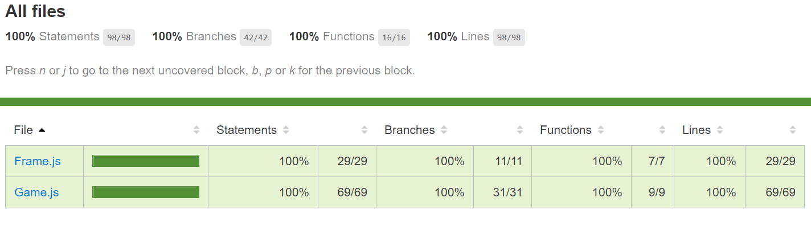
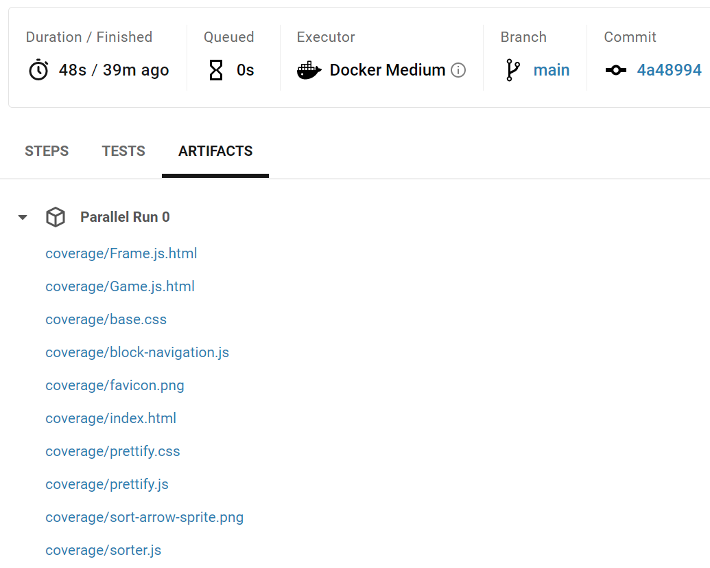

Continuous Integration [](https://circleci.com/gh/cmusv-fse/CI-CD)
==============
Continuous Integration and Deployment Recitation

Changelog
==============
1. Implementation of a bowling score card.
2. Reference for Unit Testing lab for FSE Fall 2015 at CMU-SV.
3. Updated for CircleCI Integration for FSE Spring 2018 at CMU-SV.
4. Updated for CI/CD recitation for FSE Spring 2019 at CMU-SV.
5. Updated for CI/CD recitation for FSE Fall 2019 at CMU-SV.
6. Change the testing framework from Mocha to Jest for FSE Fall 2020 at CMU-SV.
7. Add eslint and mongodb image for FSE Fall 2020 at CMU-SV.
8. Removed mongodb image, and changed cache to "package-lock.json" for FSE Spring 2021 at CMU-SV.
9. Removed legacy code-climate for FSE Fall 2021 at CMU-SV

Install
==============
Install needed tools:
```
npm install
```

Tests results
==============
```
npm run test
```

Coverage results
==============
```
npm run coverage
```




CircleCI integration
==============

1. Link your account with CircleCI by following 
["Getting Started with CircleCI"](https://circleci.com/docs/2.0/getting-started/).
1. After the account is linked, when you push changes to the repo CircleCI will run your tests and code coverage.
1. You can The coverage report is in `Artifacts > coverage/index.html`

### Artifacts > Coverage


